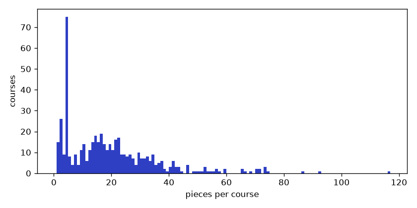

# Embedding + reranker EDA

Generated by `python manage.py embedding_eda` over 503 offered courses a pre-2026 student can take (9675 pieces). Queries: `recommender/eda/queries.json` (11 with expected codes, 3 that should match nothing). Category ignored: this tests matching only.

## Chosen configuration

**intfloat/e5-small-v2 + cross-encoder/ms-marco-MiniLM-L-6-v2, K=30**, relevance cutoff **0.58**.

Rule: highest hit@5, then MRR, then no-match correctness, then lower latency; configurations with a median latency above 1.5 s per query dropped (1 dropped).

hit@5 0.80 · MRR 0.82 · recall@candidates 0.95 · median latency 0.15 s · at the cutoff: precision 0.62, recall 0.74, no-match queries with no real match 3/3.

## All configurations

| embedder | reranker | K | hit@5 | MRR | recall@K | latency s | cutoff | precision | recall | no-match ok |
|---|---|---|---|---|---|---|---|---|---|---|
| intfloat/e5-small-v2 | cross-encoder/ms-marco-MiniLM-L-6-v2 | 30 | 0.80 | 0.82 | 0.95 | 0.15 | 0.58 | 0.62 | 0.74 | 3/3 |
| BAAI/bge-small-en-v1.5 | none | 30 | 0.79 | 0.84 | 0.95 | 0.01 | 0.72 | 0.55 | 0.77 | 2/3 |
| BAAI/bge-small-en-v1.5 | none | 50 | 0.79 | 0.82 | 0.95 | 0.01 | 0.72 | 0.53 | 0.77 | 2/3 |
| all-MiniLM-L6-v2 | none | 50 | 0.78 | 0.83 | 0.95 | 0.01 | 0.71 | 0.63 | 0.61 | 3/3 |
| all-MiniLM-L6-v2 | none | 30 | 0.78 | 0.83 | 0.95 | 0.01 | 0.71 | 0.63 | 0.61 | 3/3 |
| intfloat/e5-small-v2 | none | 50 | 0.77 | 0.83 | 0.95 | 0.01 | 0.89 | 0.61 | 0.61 | 3/3 |
| intfloat/e5-small-v2 | none | 30 | 0.77 | 0.83 | 0.95 | 0.02 | 0.89 | 0.63 | 0.61 | 3/3 |
| intfloat/e5-small-v2 | cross-encoder/ms-marco-MiniLM-L-6-v2 | 50 | 0.77 | 0.82 | 0.95 | 0.22 | 0.58 | 0.61 | 0.74 | 3/3 |
| BAAI/bge-small-en-v1.5 | cross-encoder/ms-marco-MiniLM-L-6-v2 | 30 | 0.68 | 0.81 | 0.95 | 0.20 | 0.81 | 0.66 | 0.68 | 3/3 |
| all-MiniLM-L6-v2 | cross-encoder/ms-marco-MiniLM-L-6-v2 | 30 | 0.68 | 0.80 | 0.95 | 0.15 | 0.57 | 0.62 | 0.74 | 3/3 |
| all-MiniLM-L6-v2 | cross-encoder/ms-marco-MiniLM-L-6-v2 | 50 | 0.68 | 0.80 | 0.95 | 0.18 | 0.57 | 0.62 | 0.74 | 3/3 |
| BAAI/bge-small-en-v1.5 | cross-encoder/ms-marco-MiniLM-L-6-v2 | 50 | 0.68 | 0.80 | 0.95 | 0.29 | 0.81 | 0.64 | 0.68 | 3/3 |
| intfloat/e5-small-v2 | BAAI/bge-reranker-base | 30 | 0.63 | 0.78 | 0.95 | 0.77 | 0.96 | 0.61 | 0.65 | 3/3 |
| intfloat/e5-small-v2 | BAAI/bge-reranker-base | 50 | 0.63 | 0.77 | 0.95 | 1.09 | 0.96 | 0.59 | 0.65 | 3/3 |
| all-MiniLM-L6-v2 | BAAI/bge-reranker-base | 30 | 0.63 | 0.77 | 0.95 | 0.78 | 0.95 | 0.59 | 0.65 | 3/3 |
| BAAI/bge-small-en-v1.5 | BAAI/bge-reranker-base | 30 | 0.60 | 0.79 | 0.95 | 1.16 | 0.94 | 0.62 | 0.65 | 3/3 |
| BAAI/bge-small-en-v1.5 | BAAI/bge-reranker-base | 50 | 0.60 | 0.78 | 0.95 | 1.64 | 0.94 | 0.59 | 0.65 | 3/3 |
| all-MiniLM-L6-v2 | BAAI/bge-reranker-base | 50 | 0.60 | 0.77 | 0.95 | 0.96 | 0.94 | 0.57 | 0.65 | 3/3 |

## Cutoff data (chosen configuration)

Candidates per relevance bin: expected courses vs everything else (queries with expected codes).

| relevance | expected | other |
|---|---|---|
| 0.0-0.1 | 6 | 244 |
| 0.1-0.2 | 0 | 9 |
| 0.2-0.3 | 0 | 9 |
| 0.3-0.4 | 1 | 13 |
| 0.4-0.5 | 1 | 6 |
| 0.5-0.6 | 1 | 4 |
| 0.6-0.7 | 0 | 0 |
| 0.7-0.8 | 2 | 0 |
| 0.8-0.9 | 1 | 1 |
| 0.9-1.0 | 19 | 13 |

## Top 5 per query (chosen configuration)

### large language models, natural language processing, transformers

Real matches (relevance >= cutoff): 3. Expected: BITS F471, CS F429, CS F425, CS G569.

| # | code | title | relevance | expected |
|---|---|---|---|---|
| 1 | BITS F471 | Introduction to Large Language Models | 1.00 | yes |
| 2 | CS F429 | Natural Language Processing | 1.00 | yes |
| 3 | CS G569 | Agentic Ai | 0.82 | yes |
| 4 | EEE F111 | Electrical Sciences | 0.56 |  |
| 5 | CS F407 | Artificial Intelligence | 0.56 |  |

### finance, investments, financial markets

Real matches (relevance >= cutoff): 15. Expected: ECON F312, ECON F412, FIN F313, FIN F315, ECON F315.

| # | code | title | relevance | expected |
|---|---|---|---|---|
| 1 | BITS F469 | Financing Infrastructure Projects | 1.00 |  |
| 2 | ECON F212 | Fundamentals of Finance and Accounts | 1.00 |  |
| 3 | ECON F312 | Money, Banking and Financial Markets | 1.00 | yes |
| 4 | ECON F315 | Financial Management | 1.00 | yes |
| 5 | ECON F413 | Financial Engineering | 1.00 |  |

### psychology, human behaviour

Real matches (relevance >= cutoff): 2. Expected: GS F232, HSS F323.

| # | code | title | relevance | expected |
|---|---|---|---|---|
| 1 | GS F232 | Introductory Psychology | 1.00 | yes |
| 2 | HSS F323 | Organizational Psychology | 1.00 | yes |
| 3 | HSS F328 | Human Resource Development | 0.31 |  |
| 4 | MPBA G504 | Managing People & Organization | 0.31 |  |
| 5 | GS F312 | Applied Philosophy | 0.02 |  |

### current affairs, politics, society

Real matches (relevance >= cutoff): 2. Expected: GS F243, GS F211, GS F233, HSS F346.

| # | code | title | relevance | expected |
|---|---|---|---|---|
| 1 | GS F211 | Modern Political Concepts | 1.00 | yes |
| 2 | GS F243 | Current Affairs | 1.00 | yes |
| 3 | BITS F385 | Introduction to Gender Studies | 0.24 |  |
| 4 | GS F312 | Applied Philosophy | 0.23 |  |
| 5 | BITS F214 | Science, Technology and Modernity | 0.22 |  |

### robotics, control systems

Real matches (relevance >= cutoff): 5. Expected: BITS F327, ME G511, ME G552, EEE F422, MF F315.

| # | code | title | relevance | expected |
|---|---|---|---|---|
| 1 | BITS F327 | Artificial Intelligence for Robotics | 1.00 | yes |
| 2 | CE G529 | Construction Project Control Systems | 1.00 |  |
| 3 | EEE F422 | Modern Control Systems | 1.00 | yes |
| 4 | ME G511 | Mechanisms & Robotics | 1.00 | yes |
| 5 | MF F315 | Automation and Control | 0.58 | yes |

### cybersecurity

Real matches (relevance >= cutoff): 0. Expected: BITS F463.

| # | code | title | relevance | expected |
|---|---|---|---|---|
| 1 | GS F312 | Applied Philosophy | 0.19 |  |
| 2 | CS F303 | Computer Networks | 0.00 |  |
| 3 | BITS F463 | Cryptography | 0.00 | yes |
| 4 | EEE F411 | Internet of Things | 0.00 |  |
| 5 | CS G527 | Cloud Computing | 0.00 |  |

### video editing

Real matches (relevance >= cutoff): 0. Expected: GS F321, GS F224, HSS F332.

| # | code | title | relevance | expected |
|---|---|---|---|---|
| 1 | EEE F346 | Data Communication Networks | 0.01 |  |
| 2 | CHE F497 | Atomic and Molecular Simulations | 0.00 |  |
| 3 | GS F321 | Mass Media Content & Design | 0.00 | yes |
| 4 | EEE F435 | Digital Image Processing | 0.00 |  |
| 5 | HSS F332 | Cinematic Art | 0.00 | yes |

### film, cinema

Real matches (relevance >= cutoff): 3. Expected: HSS F332, GS F322.

| # | code | title | relevance | expected |
|---|---|---|---|---|
| 1 | GS F322 | Critical Analysis of Literature and Cinema | 1.00 | yes |
| 2 | HSS F332 | Cinematic Art | 1.00 | yes |
| 3 | GS F223 | Introduction to Mass Communication | 0.81 |  |
| 4 | PHY F213 | Optics | 0.12 |  |
| 5 | HSS F324 | Science Fiction | 0.07 |  |

### journalism, writing for the media

Real matches (relevance >= cutoff): 3. Expected: GS F223, GS F244, GS F321.

| # | code | title | relevance | expected |
|---|---|---|---|---|
| 1 | GS F223 | Introduction to Mass Communication | 1.00 | yes |
| 2 | GS F244 | Reporting and Writing for Media | 1.00 | yes |
| 3 | GS F344 | Copywriting | 0.94 |  |
| 4 | GS F321 | Mass Media Content & Design | 0.49 | yes |
| 5 | GS F241 | Creative Writing | 0.29 |  |

### advertising

Real matches (relevance >= cutoff): 1. Expected: GS F224.

| # | code | title | relevance | expected |
|---|---|---|---|---|
| 1 | GS F224 | Print and Audio-Visual Advertising | 1.00 | yes |
| 2 | GS F344 | Copywriting | 0.55 |  |
| 3 | GS F321 | Mass Media Content & Design | 0.50 |  |
| 4 | GS F223 | Introduction to Mass Communication | 0.33 |  |
| 5 | PHA G616 | Pharmaceutical Administration and Manage-3 2 | 0.28 |  |

### data science

Real matches (relevance >= cutoff): 3. Expected: CS F320, BITS F464, ME F321.

| # | code | title | relevance | expected |
|---|---|---|---|---|
| 1 | CS F320 | Foundations of Data Science | 1.00 | yes |
| 2 | MAC F312 | Foundations of Data Science | 1.00 |  |
| 3 | ME F321 | Data Mining in Mechanical Sciences | 1.00 | yes |
| 4 | MATH F432 | Applied Statistical Methods | 0.24 |  |
| 5 | GS F331 | Techniques in Social Research | 0.20 |  |

### marine biology

Real matches (relevance >= cutoff): 0. Expected: none.

| # | code | title | relevance | expected |
|---|---|---|---|---|
| 1 | BIO G523 | Advanced and Applied Microbiology | 0.02 |  |
| 2 | BIO F111 | General Biology | 0.00 |  |
| 3 | BIO F214 | Integrated Biology | 0.00 |  |
| 4 | BIO F213 | Cell Biology | 0.00 |  |
| 5 | BIO G542 | Advanced Cell and Molecular Biology | 0.00 |  |

### fashion design

Real matches (relevance >= cutoff): 0. Expected: none.

| # | code | title | relevance | expected |
|---|---|---|---|---|
| 1 | DE G531 | Product Design | 0.00 |  |
| 2 | GS F376 | Design Project | 0.00 |  |
| 3 | GS F377 | Design Project | 0.00 |  |
| 4 | BITS F103 | Engg Design And Prototype | 0.00 |  |
| 5 | ENVS F211 | Hydraulics and Fluid Mechanics | 0.00 |  |

### culinary arts, cooking

Real matches (relevance >= cutoff): 0. Expected: none.

| # | code | title | relevance | expected |
|---|---|---|---|---|
| 1 | GS F222 | Language Lab Practice | 0.00 |  |
| 2 | BIOT F424 | Food Biotechnology | 0.00 |  |
| 3 | GS F322 | Critical Analysis of Literature and Cinema | 0.00 |  |
| 4 | HSS F221 | Readings from Drama | 0.00 |  |
| 5 | CHE F213 | Chemical Engineering Thermodynamics | 0.00 |  |

## Pieces

9675 pieces for 503 courses; only a title piece: 15.

```
     1 | ####                                     15
   2-5 | ################################         118
  6-10 | ###########                              42
 11-20 | ####################################     134
 21-40 | ######################################## 147
 41-80 | ############                             44
   81+ | #                                        3
```



| kind | pieces |
|---|---|
| topic | 6316 |
| description | 1030 |
| bulletin_description | 934 |
| outcome | 892 |
| title | 503 |
